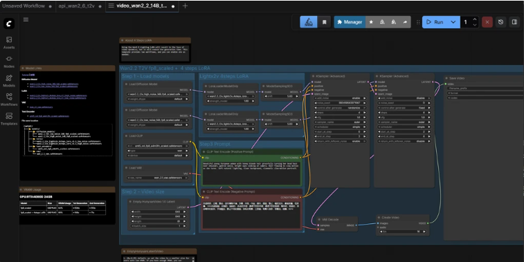

.. meta::
  :description: ComfyUI example: Wan 2.2 inference workflow
  :keywords: ComfyUI, programming, agent, ROCm, example, sample, tutorial

.. _run-comfyui-wan-inference:

***************************************************************************
Run the Wan 2.2 inference template in ComfyUI
***************************************************************************

`Wan 2.2 <https://docs.comfy.org/tutorials/video/wan/wan2_2>`__ is an advanced AI
video generation model capable of producing high-resolution videos from text
descriptions or input images. With support for various aspect ratios and
customizable generation parameters, Wan 2.2 enables creative video synthesis
for a wide range of applications.

Setup
====================================================================

To run this workflow:

1. Follow the :ref:`comfyui-on-rocm-installation` steps to set up the ComfyUI environment and launch the ComfyUI WebUI.

2. Select **Template** from the navigation panel on the left and search for the **Wan 2.2 14B Text to Video** template.

   .. figure:: ../images/wan22-templates-video.png
      :align: center
      :alt: ComfyUI Templates library with Video selected and the Wan 2.2 14B Text to Video card

      **Templates → Video:** under *Generation type*, choose **Video**, then open the **Wan 2.2 14B Text to Video** template (for example, double-click the card).

3. Once the template is loaded, click **Run** to execute the workflow.

Trigger a run
--------------------------------------------------------------------

To trigger a run, enter prompts in the **CLIP Text Encode** nodes for positive and negative prompts, then click **Run**.

   **Loaded workflow:** set positive and negative text in the **CLIP Text Encode** nodes, then use the blue **Run** button (top right).
   Model loaders and other nodes follow the template layout (for example, **Wan2.2 T2V fp8_scaled**).

You can see workflow progress at the top of the UI in the green progress bar near the top of the browser.

Additional resources
--------------------------------------------------------------------

- `ComfyUI Wan 2.2 Documentation <https://docs.comfy.org/tutorials/video/wan/wan2_2>`__
- `Wan 2.1 Model Files (HuggingFace) <https://huggingface.co/Comfy-Org/Wan_2.1_ComfyUI_repackaged>`__

